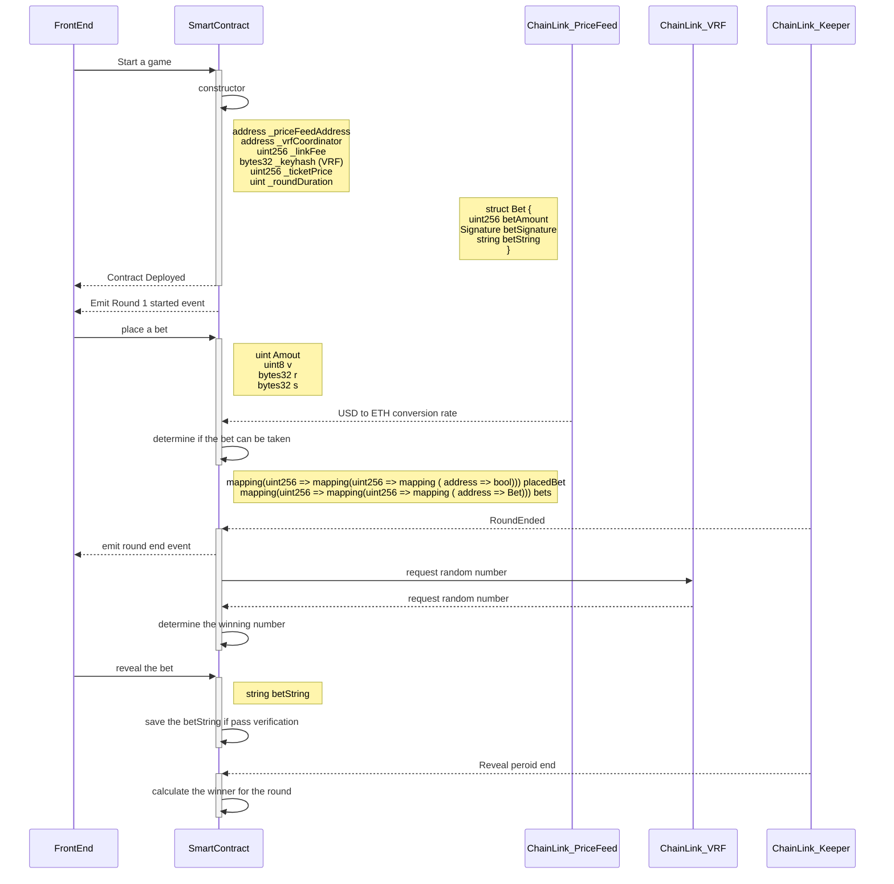

# CryptoJenga
This is a multiplayer betting game by allowing users to participate in round-by-round play where each round has specified duration (when game is created).

The front-end is built using Unity game engine and there is a backend monitoring the events emitted by the smart contract.

### Testing the game
Contract Address on Goerli Network: 0x0f24dB4c0490107027abf0C8e5042103E99e147e

Game Link: https://jacobjunior.itch.io/crypto-jenga

Chainlink VRF: https://vrf.chain.link/goerli/72

Chainlink Keeper: https://keepers.chain.link/goerli/44076444989087909005030241929667374833060791576656843945137326609272073049077

Latest Smart Contract Source Code File Path: CryptoJenga/smartContracts/contracts/cryptoJenga_v6.sol

1. Fund your Metmask with Goerli Ether (https://goerlifaucet.com/)
2. Access the game on Chrome on one device
3. Access the game on Chrome on another device (or invite a friend to join)
4. Load the smart contract in Remix and call `resetGameState` with the following parameters:
    - `_TotalRounds`: The number of of rounds users will player
    - `_MaxBets`: The number of bets users will be able to place per game
    - `_RoundDuration`: The duration of a round in seconds before when a player is able to bet
    - `_USDTicketPrice`: The price of entry to the game in USD to 18 decimal places (eg $1 would be entered as "1000000000000000000")

5. Press "play" to enter the lobby of the game
6. Press the ticket to purchase a ticket to play the game
7. Start the game from Remix by calling `StartGame`
8. Wait for the ticket text to change to "Admit" and click on the ticket again to enter the game
9. For every round the player can place bets. If a user places a bet after `_RoundDuration` the transaction will fail and the bet will not be placed
10. At the end of the last round the winner will receive the pooled funds
11. To start a new game repeat the steps from step 4.

### Testing the contract
how to test keeper + vrf

1. deploy contract on remix
2. call startGame()
3. joinGame()
4. add contract as consumer to VRF
5. register contract as a keeper

### Chainlink features used
- Price feed: the ticket price is in USD. The price feed is used for the conversion.
- VRF: used for choosing the winning answer and the winner
- Keeper: automatically move from round to round and end the game based on the duration defined.

